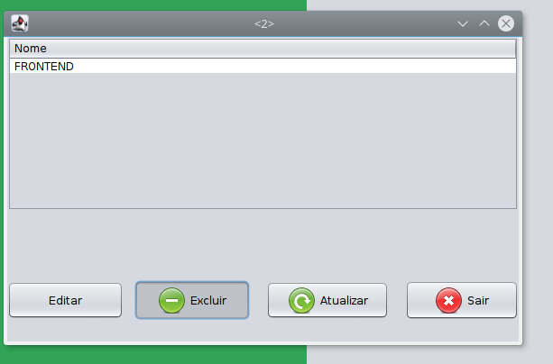
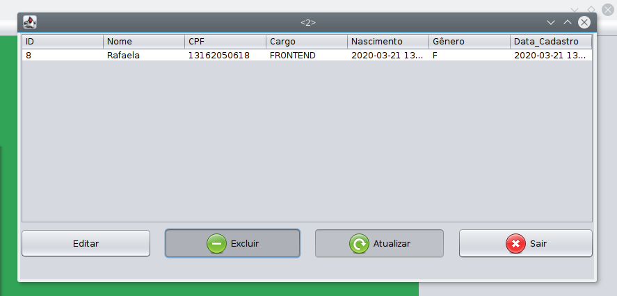

# LEMAF_CRUD
CRUD proposto pela empresa LEMAF, realizado na linguagem Java. O CRUD conta com:
   - Cadastro de Usuários ***(Interface e Método)***
   - Cadastro de Cargoss ***(Interface e Método)***
   - Lista de Usuários ***(Interface e Método)***
   - Lista de Cargos ***(Interface e Método)***
   - Edição de Usúarios ***(Interface e Método)***
   - Edição de Cargos ***(Interface e Método)***
   - Exclusão de Usuários ***(Método)***
   - Exclusão de Cargos ***(Método)***

# FERRAMENTAS & MÉTODOS
Este trabalho foi desenvolvido utilizando a linguagem de programação Java.
A conexão com o banco de dados foi feita utilizando um componente chamado
JDBC + MySQL. Na parte gráfica utilizou-se o JFrame. Os métodos implementados
são os métodos básicos de um CRUD (C-CREATE,R-READ,U-UPDATE,D-DELETE).
    - Netbens 8.1
    - MySQL Connector Java 5.1.38
    - Mysql  Ver 14.14 Distrib 5.7.27
    - Openjdk version "1.8.0_242"
    - OpenJDK Runtime Environment (build 1.8.0_242-8u242-b08-0ubuntu3~16.04-b08)
    - OpenJDK 64-Bit Server VM (build 25.242-b08, mixed mode)

A versão MySQL do conector Java:

A versão do MySQL Server:

***A criação do Database é manual ou seja o seguinte comando deve ser executado
manualmente. As demais funcionalidades são automaticas do CRUD.***
Segue o comando de Scherma.

o nome do Database PRECISA ser ***cargosUsers***.

O "user" e password adicionado para a conexão do MySQL é a padrão ***(root,root)***. 
A porta de configuração do MySQL é a porta ***3306***, assim como o nome do database
***TEM*** que ser ***cargosUsers***.
Segue a foto da aba "Services" do Netbens após a instalação dos componentes
do MySQL Server, JDBC(MySQL Connector Java), Configuração do database e 
criação do Schema(Database).

# CONFIGURAÇÃO DO WORKSPACE

A configuração dos componentes devem ser a seguinte:
    *Porta de acesso do Banco de dados.***Port:'3306'***
    *Usuário e senha de acesso ao Banco de Dados.***User:'root', Passw:'root'***
    *Criação do database(Schemas) com o nome ***'cargosUsers'***
    *Configuração de diretório do MySQL = ***'LocalHost'***
Feito as configurações e instalações adequadas dos componentes o programa executará normalmente.

# DECISÕES DE IMPLENTAÇÃO + BANCO DE DADOS
O banco de dados possui a seguinte arquitetura.
    *Duas tabelas ***(CARGOS & USUARIOS)***
    *Decidiu-se incluir 2 campos 'UID' em 'USUARIOS'e 'CID' em 'Cargos', sendo esses 2 chaves 
*primária de suas respectivas tabelas.
    *'CID' é chave primária da tabela Cargo é ***Chave Extrangeira*** _da tabela 'Usuários'_.  
    *As tabelas possuem o método ***ON CASCATE*** para evitar a existencia de registros 
 inconsistente.
 

***Decidiu-se incluir UID e CID como chaves primárias porque é usual que exista chaves primárias
do tipo Inteiro para controlar as operações dos registros.***   

# TESTES

Cadastrar Cargos:

Confirmação do Cadastro de Cargos:

View dos Cargos Cadastrados:

Edição de Cargos:

Modicação do Cargo:

Confirmação da edição do Cargo:

Resultado da edição do Cargo concluída:

Exclusão de Cargos:

Exclusão de Cargos confirmada:

Resultado da Exclusão do Cargo:

Cadastro de Usuários:

Cadastro de Usuário Validação de CPF:

Cadastro de Usuário Confirmação:

View com lista de Usuários Cadastrados:

Edição de Usuarios:

Edição de Usuarios Confirmada:

Resultado da edição de Usuários:

Exclusão de Usuários:

Resultado da Exclusão do Usuário:

##ATENÇÃO: É IMPORTANTE QUE UTILIZE OS BOTÕES *SAIR* NAS JANELAS DO PROJETO POIS ELA FINALIZA
##ADEQUADAMENTE AS FUNCIONALIDADES. O BOTÃO X QUE EXISTE NO CANTO SUPERIOR DAS JANELAS NÃO
##REALIZA A FUNÇÃO COM SEGURANÇA MAS PARA A EXECUÇÃO GERAL DO PROJETO.

